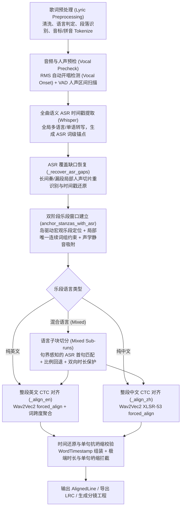

# 音频歌词对齐匹配全流程与演进维护指南 (Audio-Lyric Alignment Lifecycle)

> 本文档用于系统性记录与持续维护 **suno2MV** 的音频歌词多阶段对齐管道、证据优先策略、混合语言分段机制及异常边界保护规则。

---

## 1. 核心设计原则

1. **原歌词是唯一的 Ground Truth (不可篡改)**：
   * 原歌词决定了文本、语言、标点、段落归属及演唱顺序。
   * ASR（Whisper）识别文本仅作为“时间定位证据”，绝不直接改写、替换原歌词文字或调整歌词顺序。
2. **证据优先，估算补缺 (Evidence-First, Estimation-Fallback)**：
   * 具有强唯一性与单调时序的 ASR 连续词组证据，优先级高于纯数学比例估算或均分窗口。
   * 估算与静音吸附仅用于填补缺失/低置信度的空白边界。
3. **句界感知与局部保护 (Sentence-Boundary Aware)**：
   * 证据仅能证实其覆盖部分的时间位置，不能被随意超范围外推至未匹配的整段或前置句。
   * 单句如果漏检，不能让后一句的 ASR 起点提前吞噬前一句的生存窗口。
4. **双向发音时长保护 (Bilateral Duration Guarantees)**：
   * 任何段落或语言块切分，必须同时保证当前块与后续剩余块都具备最低发音物理时长（按 token 数量保守计算），严禁挤压坍缩。

---

## 2. 对齐管道架构与完整流程



---

## 3. 各阶段技术规范与防坑机制

### 3.1 自动开唱检测与首段保护 (Vocal Onset)
* **机制**：通过 RMS 能量扫描跳过前奏杂音与伴奏渗漏。
* **证据校正**：如果首段内存在高置信度的局部词组证据早于自动检测的 `vocal_onset`，允许可靠证据向前修正开唱点（避免自动开唱误判截断首句）。

### 3.2 全曲 ASR 缺口局部恢复 (`_recover_asr_gaps`)
* **触发条件**：两个 ASR 片段相距 $\ge 8.0\text{s}$，且该空隙内 VAD 实际检测到歌唱人声累计 $\ge 5.0\text{s}$。
* **切片策略**：剔除上一段末尾残余（$<2\text{s}$），抓取真实人声核心区进行局部 Whisper 识别。
* **合并准则**：局部切片相对时间偏移还原为全局绝对时间，且仅当产生 $\ge 4$ 个新 token 时才合并，防止噪声污染。

### 3.3 乐段窗口定位与锚点约束 (`anchor_stanzas_with_asr`)
* **有效局部约束标准**：
  * 至少连续匹配 4 个 token 且覆盖整句 50% 以上，或连续匹配 $\ge 6$ 个 token。
  * 在歌词与 ASR 中具备**全局唯一性**（排查重复副歌误吸附）。
  * 保持严格单调递增时序链。
* **约束机制**：估算窗口与静音吸附点必须包络已确认的局部片段，绝不允许外推算法将证据裁剪到窗口外。

### 3.4 混合语言段落切分 (`Mixed-Language Sub-runs`)
当一个段落内中英文混杂时（例如一段内前两句中文、后两句英文）：
1. **提取候选与比对**：提取下一语言块 `next_run` 的 phonetic tokens，与段内 ASR 词做模糊序列比对。
2. **首句句界检查 (`first_line_tok_count`)**：
   * 检查最佳匹配块起始索引 `vbs[0].a` 是否落在下一语言块的**第一句之内**。
   * **若落在第一句内**：说明匹配到了该块开头，若有少量首词未检出，做保守线性推算：
     $$\text{found\_next\_s} = \text{matched\_asr\_s} - \text{head\_tok\_idx} \times 0.35$$
   * **若已越过第一句**（例如第一句整句漏检，匹配命中第二句）：**严禁将第二句的时间作为整个语言块的起点**，立即回退至发音单元比例切分点 `ideal_split`。
3. **双向物理时长安全保护**：
   * 当前块最小发音时长：$\text{min\_run\_dur} = \max(0.8\text{s}, \text{toks} \times 0.30\text{s})$
   * 剩余所有块保留时长：$\text{min\_rem\_dur} = \max(0.8\text{s}, \text{rem\_toks} \times 0.30\text{s})$
   * 切分点被严格夹紧在区间 $[c\_s + \text{min\_run\_dur},\; p\_e - \text{min\_rem\_dur}]$ 内。
4. **声学静音吸附**：
   * `find_silence_snap` 的扫描区间同样受 `[min_t, max_t]` 双向严格钳制，杜绝吸附越界。

### 3.5 CTC 精细强制对齐与坍缩防范
* **音素/字级强制对齐**：使用 Wav2Vec2 进行 Viterbi 发音单元发射概率解码。
* **局部坍缩拦截**：
  * 发音字词时长 $\le 0.035\text{s}$ 时判定为声学坍缩。
  * 触发异常时启动平滑均匀切分兜底，并在结果中标记低置信度警告。

---

## 4. 关键案例与回归基准库

| 歌曲用例 | 场景特点 | 典型对齐陷阱 | 防御与测试措施 |
| :--- | :--- | :--- | :--- |
| **Road Closed, Door Open** (`road_closed`) | 中英混合演唱段落（中文后接英文） | ASR 漏检英文第一句，直接识别出第二句；切分点误用第二句时间导致第一句被压缩至 0.7s | 首句句界检测 + 比例回退 + 双向最短时长保护；确保 L7/L8 均获合理时间 |
| **Tailwind** (`tailwind`) | 双副歌、长间奏、漏检恢复 | 两次副歌歌词相同引发唯一性混淆；全曲识别丢失第二次副歌（68-98s） | `_recover_asr_gaps` 局部切片补全证据；词组唯一性校验避免副歌串位 |
| **Look Up Child** (`look_up`) | 纯英文长前奏及重复段 | 前奏伴奏较响引发自动开唱漂移 | `vocal_onset` 结合首段可靠词组证据向前修正 |

---

## 5. 日常维护与修改 CheckList

在后续优化对齐引擎或修改相关函数（如 `src/aligner.py`）时，开发者必须核对以下清单：

- [ ] **是否破坏原歌词？** 严格禁止对原歌词文本、顺序和标点做破坏性改写。
- [ ] **改动是否仅依赖“绝对时间点”？** 任何时间推算必须有上限与下限（双向 clamp），不能单向依赖加减法。
- [ ] **是否跑通专项回归？**
  ```bash
  .venv/bin/python -m pytest tests/test_alignment_regression.py
  ```
- [ ] **是否跑通全量单元测试？**
  ```bash
  .venv/bin/python -m pytest -q
  ```
- [ ] **真实音频复核**：针对受影响段落，人工听检起唱与收音是否贴合鼓点或人声起始（严防出现抢唱或严重滞后）。
