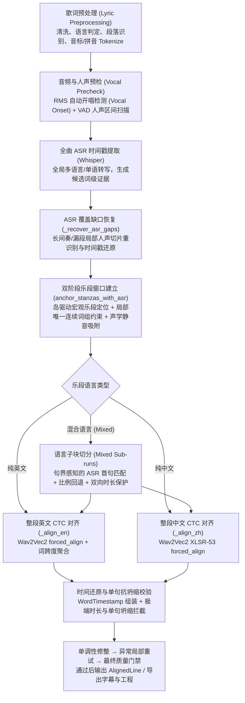

# 音频歌词对齐匹配全流程与演进维护指南 (Audio-Lyric Alignment Lifecycle)

> 本文档用于系统性记录与持续维护 **suno2MV** 的音频歌词多阶段对齐管道、证据优先策略、混合语言分段机制及异常边界保护规则。

---

## 1. 核心设计原则

1. **原歌词是唯一的 Ground Truth (不可篡改)**：
   * 原歌词决定了文本、语言、标点、段落归属及演唱顺序。
   * ASR（Whisper）识别文本仅作为“时间定位证据”，绝不直接改写、替换原歌词文字或调整歌词顺序。
2. **证据优先，估算补缺 (Evidence-First, Estimation-Fallback)**：
   * 具有强唯一性与单调时序的 ASR 连续词组证据，优先级高于纯数学比例估算或均分窗口。
   * 估算与静音吸附仅用于填补缺失/低置信度的空白边界。
3. **句界感知与局部保护 (Sentence-Boundary Aware)**：
   * 证据仅能证实其覆盖部分的时间位置，不能被随意超范围外推至未匹配的整段或前置句。
   * 单句如果漏检，不能让后一句的 ASR 起点提前吞噬前一句的生存窗口。
4. **混合语言块的双向窗口保护**：
   * 混合语言切分为当前块和每个剩余块预留建议时长；这是启发式预算，并非最低发音物理时长。预算无法满足时记录警告并按剩余词量分配，不生成越界窗口。其他段落定位使用各自的边界策略，不能声称全管道都应用同一预算。

---

## 2. 对齐管道架构与完整流程



---

## 3. 各阶段技术规范与防坑机制

### 3.1 自动开唱检测与首段保护 (Vocal Onset)
* **机制**：在人声分离结果上扫描 RMS 能量，估计开唱与活跃区间。这不是能够判定人声类别的 VAD，伴奏渗漏也可能触发，不能保证跳过全部前奏杂音。
* **证据校正**：如果首段内存在高置信度的局部词组证据早于自动检测的 `vocal_onset`，允许可靠证据向前修正开唱点（避免自动开唱误判截断首句）。
* **显式起点**：配置 `lyrics_start_time > 0` 时优先保留用户指定起点，不以自动证据向前覆盖。

### 3.2 全曲 ASR 缺口局部恢复 (`_recover_asr_gaps`)
* **触发条件**：两个 ASR 片段相距 $\ge 8.0\text{s}$，且该空隙内 RMS 活跃区间累计 $\ge 5.0\text{s}$。若 ASR 幻觉填满缺口，本规则可能无法触发。
* **切片策略**：忽略不足 2 秒的活跃片段，从首个有效活跃片段前 0.4 秒开始局部识别；每次最多两个缺口，每片最多 30 秒。这些能量区间不等于已经确认的歌词人声。
* **合并准则**：局部切片相对时间偏移还原为全局绝对时间，且仅当产生 $\ge 4$ 个新 token 时才合并，防止噪声污染。

### 3.3 乐段窗口定位与锚点约束 (`anchor_stanzas_with_asr`)
* **有效局部约束标准**：
  * 至少连续匹配 4 个 token 且覆盖整句 50% 以上，或连续匹配 $\ge 6$ 个 token。
  * 在歌词与 ASR 中具备**全局唯一性**（排查重复副歌误吸附）。
  * 保持严格单调递增时序链。
* **约束机制**：段落定位的估算窗口与静音吸附点必须包络已接受的局部片段，冲突时报告错误。局部证据目前约束的是段落窗口，不直接锁定每一句的 CTC 时间；窗口包含证据不等于句级结果一定覆盖证据。

### 3.4 混合语言段落切分 (`Mixed-Language Sub-runs`)
当一个段落内中英文混杂时（例如一段内前两句中文、后两句英文）：
1. **提取候选与比对**：提取下一语言块 `next_run` 的 phonetic tokens，与段内 ASR 词做模糊序列比对。
2. **首句句界检查 (`first_line_tok_count`)**：
   * 检查最佳匹配块起始索引 `vbs[0].a` 是否落在下一语言块的**第一句之内**。
   * **若落在第一句内**：允许作为该块起点候选；若首词未检出，做启发式线性推算（不代表已找到真实开头）：
     $$\text{found\_next\_s} = \text{matched\_asr\_s} - \text{head\_tok\_idx} \times 0.35$$
   * **若已越过第一句**（例如第一句整句漏检，匹配命中第二句）：**严禁将第二句的时间作为整个语言块的起点**，立即回退至发音单元比例切分点 `ideal_split`。
3. **剩余时间与双向预算保护**：
   * `ideal_split = c_s + (p_e - c_s) × 当前块 tokens / 剩余全部块 tokens`。每次切分重新计算，避免早先证据调整边界后继续沿用整段时长。
   * 当前块最小发音时长：$\text{min\_run\_dur} = \max(0.8\text{s}, \text{toks} \times 0.30\text{s})$
   * 上述“最小”只指建议预算；剩余保留时长为每个剩余块预算之和：$\sum_j \max(0.8\text{s}, \text{toks}_j \times 0.30\text{s})$。
   * 预算充足时切分点夹紧在区间 $[c\_s + \text{min\_run\_dur},\; p\_e - \text{min\_rem\_dur}]$ 内；不足时上下界均设为比例点并记录需复核警告，避免颠倒区间或越过段尾。
4. **声学静音吸附**：
   * `find_silence_snap` 的扫描结果及舍入都受 `[min_t, max_t]` 钳制；上下界颠倒会明确报错。

### 3.5 CTC 精细强制对齐与坍缩防范
* **段内强制对齐**：同语言的多句文本联合输入中/英文 CTC，再按原歌词索引还原句与词；并非所有句子各自有声学锚点。其他语言走局部 Whisper 匹配，不能称全流程为纯 CTC。同一句内混合语言目前按整句语言路由，仍有丢失非主语言字词声学证据的风险。
* **均分兜底**：空音频、异常或缺少有效映射等分支可能按字符均分。部分 CTC 分支也检查 35ms 短词，但已有 50ms 下限可使检查失效。均分不等于声学成功，且目前不是所有兜底分支都有 `needs_review` 标记。
* **单调性修整**：先推移重叠时间并赋予至少 20ms 词长，再进行异常局部重对齐；修整不证明识别正确。自愈没有改善且未通过边界校验时保留原结果并标记 `needs_review`。
* **最终拒绝条件**：全曲至少 12 个发音单位时，至少 40% 时长不超过 35ms；或单句至少 4 个单位且句长不足 0.25s / 至少 80% 时长不超过 35ms；或单词时长超过 20s。命中任一条件抛错，不能作为成功结果。这些检查不能发现全部正常时长的错位。

### 3.4.1 同语言段内长静音防漂移切分 (`Intra-stanza Silence-Gated Sub-runs`)
当同语言乐段（如 6 句连续英文）内部存在长间奏或显著停顿（例如换气停顿 $\ge 0.8\text{s}$）：
* **痛点**：全局 CTC forced alignment 会因贪婪搜索在长空白区间强行拉伸发音单元，导致静音后的句子被提前数秒“抢唱”。
* **防御机制**：
  1. 仅对**同语言段落**生效（混语言段落走 3.4 节子块切分，互不干扰）。
  2. 后续句在 ASR 词流中必须具有**全曲全局唯一**的连续词组证据（$\ge 3\sim 4$ 个 token，且原歌词中唯一），杜绝副歌重复词导致的跨时空误切分。
  3. 必须在当前句安全物理发音时长与后续句起唱点之间检测到 $\ge 0.8\text{s}$ 的真实声学静音。
  4. 满足条件时，在静音谷底执行 `find_silence_snap` 平滑切分，将前后句解耦为独立 sub-runs 分别对齐。

### 3.4.2 段间隙平滑的下一段首句起唱阻断 (`Inter-stanza Head-onset Clamping`)
在段落间隙（`1.5s <= gap <= 4.0s`）执行平滑过渡时：
* **痛点**：若盲目取上一段结束与下一段起始的数学中点并吸附静音，当中点落入下一段首句实际开唱范围之后时，会导致上一段窗口向后过度膨胀，吞入下一段首句的真实人声（例如第 7 句开唱于 40.5s，但上一段被拉伸到 41.3s/42.6s）。这不仅挤压上一段尾词的自然长拖音（如 Line 6 的 `holding`），更会导致后续句子连锁错位。
* **防御机制**：
  1. 检查下一段首句在间隙附近的连续 ASR 音素词组证据（`head_onset`）。
  2. 若检测到明确的首句起唱点且早于原段落起始，将上一段边界上限硬性截断（`max_bound = min(max_bound, head_onset)`）。
  3. 若上一段当前估算结束时间偏晚，先将其收缩至 `head_onset` 前的静音谷底，再在安全区间内执行静音吸附，保证上一段严格在下一段首句开唱前闭合。

---

## 4. 关键案例与回归基准库

| 歌曲用例 | 场景特点 | 典型对齐陷阱 | 防御与测试措施 |
| :--- | :--- | :--- | :--- |
| **Circus in my head** (`circus`) | 英文长乐段、长拖音/转音、段间紧凑连接 | 段内 4-5 句间停顿导致抢唱；段间中点平滑使上一段尾侵入下一段首句（40.5s），导致 holding 拖音受挤压且 7-8 句连锁错位 | 同语言段内长静音切分（第 5 句锁在 32.87s）；段间首句起唱证据阻断（第 6 句于 40.02s 闭合、holding 完整舒展至 39.5s、第 7 句 40.14s 准确开唱） |
| **Road Closed, Door Open** (`road_closed`) | 中英混合演唱段落（中文后接英文） | ASR 漏检英文第一句，直接识别出第二句；切分点误用第二句时间导致第一句被压缩至 0.7s | 首句句界检测 + 比例回退 + 双向最短时长保护；确保 L7/L8 均获合理时间 |
| **Tailwind** (`tailwind`) | 双副歌、长间奏、漏检恢复 | 两次副歌歌词相同引发唯一性混淆；全曲识别丢失第二次副歌（68-98s） | `_recover_asr_gaps` 局部切片补全证据；词组唯一性校验避免副歌串位 |
| **Look Up·抬头看** (`look_up`) | 中英文段落、重复副歌与口哨间奏 | 开唱及长间奏边界漂移 | 起点与间奏锚点回归、局部词组窗口保护 |

---

## 5. 日常维护与修改 CheckList

在后续优化对齐引擎或修改相关函数（如 `src/aligner.py`）时，开发者必须核对以下清单：

- [ ] **是否破坏原歌词？** 严格禁止对原歌词文本、顺序和标点做破坏性改写。
- [ ] **改动是否仅依赖“绝对时间点”？** 任何时间推算必须有上限与下限（双向 clamp），不能单向依赖加减法。
- [ ] **是否跑通专项回归？**
  ```bash
  .venv/bin/python -m pytest tests/test_alignment_regression.py
  ```
- [ ] **是否跑通全量单元测试？**
  ```bash
  .venv/bin/python -m pytest tests/ -q -m 'not local_only'
  ```
- [ ] **真实音频复核**：针对受影响段落，人工听检起唱与收音是否贴合鼓点或人声起始（严防出现抢唱或严重滞后）。

本地音频回归需单独执行上面的专项命令；通用测试排除 `local_only`，避免 CI 使用个人账号和本地凭据。三首回归的音频、分离结果与 ASR 缓存可被复用；它验证的是实际 CTC 重算与选定锚点，并不等于重新下载、重新分离、无缓存转写或逐字人工听检。
