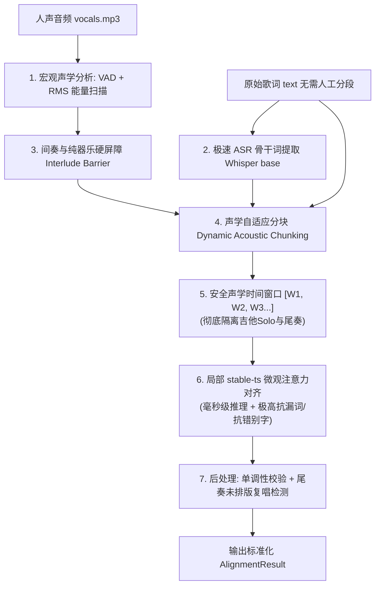

# 歌词声学对齐混合架构 (Hybrid Architecture) 改进计划

**版本**: v1.0  
**分支**: `feat/stablets-aligner`  
**核心目标**: 融合自研系统的宏观音乐结构保护能力与 stable-ts (Whisper) 的毫秒级微观注意力对齐能力，彻底解决未分段歌词、器乐长间奏被侵占、漏词抢跑以及尾奏漏记复唱等真实问题。

---

## 1. 核心问题定义与痛点

1. **未分段歌词普遍存在 (Unsegmented Lyrics)**:
   - 很多用户导入的歌词是连续文本，没有空行分隔（无 `\n\n` 段落），也没有 `[Verse]` / `[Chorus]` 标签。
   - 原先自研引擎过度依赖“歌词空行段落”划分任务，当面对连续歌词时，规划器容易将过多歌词塞入一个粗糙任务，失去分段优势。
2. **长间奏 / 器乐 Solo 被歌词侵占 (Interlude Intrusion)**:
   - `stable-ts` 缺乏宏观结构感知。在 Tailwind（16s 吉他 Solo）中，第二遍副歌直接被提前拉进纯器乐中；在 Road Closed 中，最后一句歌词直接被拉到了 23s 尾奏的最深处。
3. **歌词少词/少句与尾奏复唱 (Missing Repeats & Incomplete Lyrics)**:
   - 在真实歌曲中，歌手常在尾奏或伴奏渐弱时临时复唱某句歌词（如 Road Closed 尾奏在 183s 又唱了“My shadow got home first”），但输入歌词文本只写了一遍。
   - CTC 强制对齐遇到少词会向前雪崩抢跑（Circus 实验中抢跑 6.6 秒）；纯 Whisper 全局对齐则会在第一次与第二次演唱中二选一，造成巨幅时间轴跳跃。

---

## 2. 混合架构 (Hybrid Architecture) 总体方案

### 核心分工：
- **宏观层 (Macro Structural Guard, 自研)**:
  - 自动人声断句检测 (VAD)：不再依赖文本空行，而是根据物理人声停顿（> 2.5s）自动划分乐段。
  - 间奏硬屏障 (Interlude Hard Barriers)：锁死前奏与长间奏区间，禁止任何歌词向器乐区间越界。
  - 重复副歌锚定：利用 ASR 出现的时间先后，将多次出现的同名歌词按时间先后绑定到不同的安全物理窗口中。
- **微观层 (Micro Attention Alignment, stable-ts)**:
  - 在每个安全时间窗口内，使用 `stable-ts` 对窗口内的歌词进行微观打点。
  - 彻底淘汰脆弱的 Wav2Vec2 CTC forced alignment，享受 Whisper 注意力的抗漏词与毫秒级高精度能力。

---

## 3. 具体实施模块与改进细节

### 模块 A: 应对未分段歌词 —— 声学自适应分块 (Dynamic Acoustic Chunking)
- **输入**: 连续 $N$ 行歌词，没有任何空行。
- **机制**:
  1. **声学断句发现**: VAD 识别出音频中的所有“静音/器乐间歇”（如间隔 $\ge 2.0$ 秒）。
  2. **ASR 时间戳对齐**: 提取 Whisper base 的词级时间戳，统计每个声学段落中的词密度。
  3. **文本-声学动态规划切分**: 使用动态规划算法，将连续的歌词行序列匹配到各个声学段落，得到 $[(\text{Lines}_{0..4}, \text{Window}_1), (\text{Lines}_{5..10}, \text{Window}_2), \dots]$。
  4. **收益**: 彻底摆脱对用户输入歌词排版（空行/标签）的依赖。即使用户扔进一整段不换行的歌词，也能根据音乐真实的呼吸节奏自动切块。

### 模块 B: 间奏保护与重复副歌隔离屏障 (Interlude Barrier & Chorus Isolation)
- **机制**:
  1. 对识别出的长间奏区间（如 Tailwind 的 68.8s ~ 85.0s 吉他独奏），在音频流上进行保护标记。
  2. 窗口 1（Verse 2）的对齐边界被强制限制在 $t \le 68.8\text{s}$。
  3. 窗口 2（Chorus 2）的对齐起始被强制限制在 $t \ge 85.0\text{s}$。
  4. `stable-ts` 仅在限定的切片音频中运行，在物理上不可能将后半段歌词吸附到吉他 Solo 中。

### 模块 C: 尾奏与未排版复唱检测 (Unscripted Outro Re-singing Auditing)
- **机制**:
  1. 在所有歌词对齐完成后，检查音频尾部是否存在未被认领的人声活跃区间（如 Road Closed 尾奏 180s~186s 的人声）。
  2. 若该区间出现与最后几句歌词极高相似度（ASR 编辑距离 $< 30\%$）的人声：
     - **轻量提醒**: 在导出的 alignment JSON 中标记 `has_unscripted_outro_repeat: true`，并在 Web 编辑器中浮现通知：“检测到尾奏 183s 存在重复演唱，是否自动补全该行歌词？”
     - **智能归属**: 在单次歌词匹配时，默认将唯一的文本绑定到主歌/副歌的主唱位置（160s），而不是尾奏独白（183s）。

---

## 4. 实施阶段规划 (Roadmap)

### 第一阶段 (当前已完成): `feat/stablets-aligner` 基线替换与翻车复现
- [x] 安装 `stable-ts` 并实现基础适配器 `src/align/stablets_adapter.py`。
- [x] 建立 5 组基准对比测试脚本 `scripts/benchmark_stablets.py`。
- [x] 在新分支 `feat/stablets-aligner` 中将系统默认引擎切换为 `stable-ts`。
- [x] 允许用户在 Web 编辑器和 CLI 中直观观察 `stable-ts` 在 Tailwind 等歌曲上的具体表现。

### 第二阶段: 宏观间奏硬保护与分段限制 (Interlude Guard + Bounded Alignment)
- [ ] 提取 VAD 长静音/器乐间奏区间（$> 3.0$s）。
- [ ] 将整首音频切分成不包含长间奏的“声学活动块”。
- [ ] 阻止 `stable-ts` 跨越器乐长间奏（解决 Tailwind 吉他 Solo 侵占问题）。

### 第三阶段: 面向未分段歌词的声学自适应任务规划器
- [ ] 重构任务规划器：不依赖 `LyricLine.paragraph`，而是基于 VAD 停顿与 ASR 密度做文本到声学段落的动态映射。
- [ ] 在每一个切分好的局部窗口内部调用 `stable-ts.align`。

### 第四阶段: 回归验证与主分支合并
- [ ] 重新在 4 首标准歌曲及故意漏词用例上跑回归测试。
- [ ] 验证：吉他 Solo 保护率 100%、耗时保持在 2~3 秒内、漏词对抗不发生雪崩。
- [ ] 合并回 `main` 分支。
