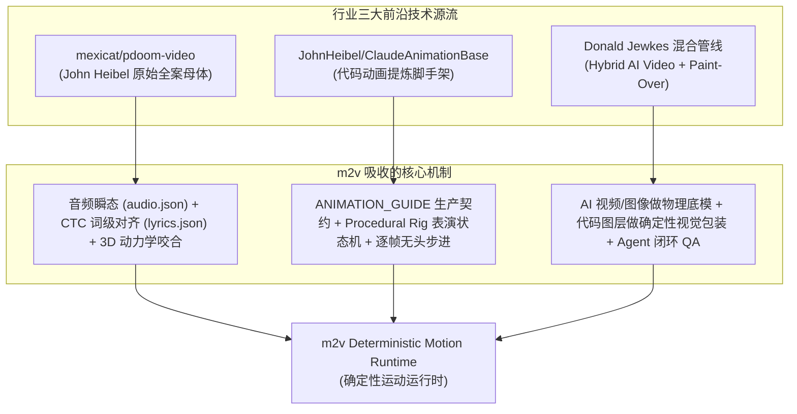

# 《m2v 下一代确定性运动运行时与 AI 原生音乐视频流水线白皮书》
> **m2v: Next-Gen Deterministic Motion Runtime & AI-Native Music Video Pipeline**  
> *Author: AI Systems Architecture Team & Product Core*  
> *Version: 1.0.0 | Date: 2026-09-29*

---

## 1. 执行摘要与战略愿景 (Executive Summary)

在生成式 AI 与音乐视觉化的交汇点上，行业正经历从“随机抽卡”到“可控工业生产”的深刻范式转变。

当前绝大多数 AI 视频工具陷入了两大技术陷阱：
1. **过重模式的“纯文本生成视频（T2V）”陷阱**：强行用扩散模型生成每一秒长视频，带来昂贵的算力成本（\$5 ~ \$20/首）、极长的等待时间、不可控的角色变脸与画面融化变形；
2. **过轻模式的“土味字幕变色”陷阱**：仅仅沿袭传统 KTV 逐字变色，字体呆板，缺乏视觉美感与现代平面设计律动。

然而在社交传播平台（TikTok、抖音、B站、Reels）上，**超过 70% 的高传播度音乐爆款视频，本质上是“高审美基底资产 + 强节奏动感视觉排版（Motion Design / Kinetic Typography）”的结晶**。

本项目 `suno2MV` (m2v) 正式提出其核心战略定位：

> **“放弃一上来全靠 AI 生成纯实景电影的不切实际幻想，聚焦于‘给任何歌曲生成一个导演过的、可编辑、可复现、视觉统一’的 Motion MV。”**

通过建立一套**模型无关、时间绝对可寻址、100% 确定性**的 **`Deterministic Motion Runtime`（确定性运动运行时）** 与 **`Motion Timeline DSL`**，m2v 将成为首个真正兼顾“极致视觉表现力”、“确定性可控性”与“低成本批量化交付”的 AI-Native 音乐视频生产引擎。

---

## 2. 行业三大前沿技术源流与启发 (Lineage & Inspirations)

m2v 的架构并非空中楼阁，而是深度融合了开源与生成式社区的三大标杆探索：



### 2.1 `mexicat/pdoom-video`（全案工程母体）
由 John Heibel 开源的病毒式全案作品《I'm Upping My P(doom)》奠定了现代代码音乐视频的标准：
- **Python 端**：利用 Demucs 进行人声分离，通过 Whisper 与 CTC Emissions 强制对齐算法生成毫秒级 `lyrics.json`，并提取伴奏瞬态与能量包络至 `audio.json`；
- **Web 端**：基于 Three.js 实现纯粹由 `lyrics.json` 与 `audio.json` 驱动的确定性 3D 字体与动力学场景。
- **启发**：验证了 **“Python 负责音频与语义理解，Web 负责毫秒级确定性图形动力学渲染”** 的分工是最优解。

### 2.2 `JohnHeibel/ClaudeAnimationBase`（动画规范与程序化表演）
从上述项目提炼出的通用轻量脚手架：
- 提出 **`Frame = F(t, scene, assets, seed)`** 的铁律：所有帧均为纯时间函数，并行独立求值，帧间不传递隐藏状态；
- **Procedural Rig**：角色表演非简单贴图切换，而是将面部微表情、肢体形变（Squash & Stretch）与节拍响应参数化；
- 提供 `studio.html` 毫秒级寻道（Scrubbing）与无头 Chromium 离线逐帧高清导出。

### 2.3 Donald Jewkes 混合管线（Hybrid Production）
展示了 Claude Opus 5.5 自主工作 12 小时的顶级商业化案例：
- **AI 视频/图像模型只负责底层的光影与物理世界实体（Base Clips）**；
- **JavaScript 代码负责表层的确定性视觉设计（Paint-Over / Typography / Stickers）**；
- 证明了通过代码覆盖层解决 AI 视频文字模糊与融化畸变的有效性。

---

## 3. 核心架构设计 (System Architecture)

### 3.1 核心解耦原则：Renderer 不直接认识歌曲
系统分为两大边界清晰的层次：
- **上层（Intelligence）**：Music & Lyric Understanding + AI Director，输出标准化的 `Motion Timeline DSL`；
- **下层（Execution）**：Deterministic Motion Runtime，接收 `DSL + t`，输出该毫秒的纯视觉帧 `frame(t)`。

```
             [ 上层：智能与导演编排 (Intelligence) ]
                               │
               ┌───────────────┴───────────────┐
               ↓                               ↓
       Audio Understanding             Visual Director
   (Demucs / Whisper / librosa)         (llm_director.py)
               │                               │
               └───────────────┬───────────────┘
                               ↓
                   [ Motion Timeline DSL ]
                               ↓
             [ 下层：确定性渲染执行 (Execution Runtime) ]
                               │
        ┌──────────────────────┼──────────────────────┐
        ↓                      ↓                      ↓
 [DOM Previewer]        [Canvas FX Layer]      [Headless Exporter]
  (60/120Hz 实时预览)     (粒子/胶片/手绘质感)     (逐帧步进 -> FFmpeg)
```

---

### 3.2 运行时状态求值解耦 (State Evaluation Decoupling)

为彻底解决“网页能预览但视频导不出”的行业通病，运动预设（Presets）严禁直接操作 DOM：

$$\text{Cue} + t + \text{Seed} \xrightarrow{\text{Preset.evaluate}} \text{MotionState}\{x, y, \text{scale}, \text{rotation}, \text{opacity}, \text{fontWeight}, \dots\} \xrightarrow{\text{Renderer}} \text{DOM / Canvas / Worker}$$

- **`Preset.evaluate` 是纯数学求值器**：不含任何环境副作用；
- **实时预览**：将 `MotionState` 喂给 `DOMRenderer`，获得极度锐利的字体抗锯齿与 CSS3 硬件加速；
- **离线无损导出**：将相同的 `MotionState` 喂给 `CanvasRenderer` 或无头渲染进程，按 `frame_idx / FPS` 步进截图，交由 FFmpeg 压制。

---

### 3.3 双时钟调度架构 (Dual-Clock Transport)

1. **Preview Clock（实时预览时钟）**：
   - 遵从 **“Audio = Master Clock, Motion = Slave”** 铁律；
   - 严格由音频播放器（WaveSurfer）的当前物理播放秒数驱动，严禁在渲染循环内部做 `time += dt` 累加，彻底杜绝切后台或掉帧引起的音画漂移（Drift）。
2. **Export Clock（离线导出时钟）**：
   - 遵从 **“Frame Stepper”** 离线步进机制；
   - 无论单帧渲染需要 10ms 还是 2 秒，时间轴按严格的 $\Delta t = \frac{1}{\text{FPS}}$ 推进，保证导出的视频每一帧绝对锁死、无一掉帧。

---

### 3.4 确定性伪随机（Seeded PRNG）

在潮流贴纸（Street Pop）等需要微小倾角、随机偏移的视觉风格中，**严禁使用裸 `Math.random()`**。
系统引入基于哈希的伪随机数发生器：
$$\text{seed} = \text{hash}(\text{shot\_id} + \text{phrase\_id} + \text{word\_id})$$
保证无论时间轴反复拖拽、倒流、截图 QA 还是重新导出，该词在特定时刻的几何位姿恒定如一。

---

## 4. 系统的能力分层阶梯 (Levels of Capability)

| 阶梯等级 | 模式定义 | 依赖输入 | 成本与吞吐 | 商业与产品定位 |
| :--- | :--- | :--- | :--- | :--- |
| **Level 1** | **100% 确定性动感歌词与平面动效** (Kinetic Typography) | 歌曲音频 + 词级时间戳 | 毫秒级响应，0 GPU 费用 | 基础通用 SaaS API，高频低成本 |
| **Level 2** | **资产驱动型 MV** (Asset-driven: 15~20张高清插画 + 视差/Ken Burns + 动效) | 歌曲 + 15张静态图 | 几秒生成，<$0.1 成本 | **商业黄金甜点位 (Sweet Spot)** |
| **Level 3** | **视频驱动型 MV** (Video-driven: AI 视频做底模 + 代码图层做包装) | 歌曲 + 动态视频 Take | 分钟级生成，中等成本 | 电影感叙事与现代设计混合 |
| **Level 4** | **Agent 动态代码生成** (Codegen fallback: 现场编写 Scene 类) | 抽象意象 + Claude 编程 | 按需生成代码 | 解决长尾超现实创意的利器 |
| **Level 5/6**| **端到端纯自主演员表演与电影仿真** | 纯文本指令 | 极高算力与时间 | 长期前沿愿景，不作短期商业承诺 |

---

## 5. 双层 API 服务化标准 (Dual-API Standard)

系统天然支持标准化为两类商业接口：

### 5.1 模式 A：渲染引擎服务 (`POST /v1/render`)
- **定位**：Renderer as a Service（确定性、高并发、便宜、快）；
- **输入**：`audio_url` + `motion_timeline.json` + `style` + `resolution`；
- **输出**：渲染完成的高清 MP4 与封面图；
- **受众**：B 端音乐发行平台、短视频矩阵系统、第三方剪辑软件。

### 5.2 模式 B：创意工作室服务 (`POST /v1/create-mv`)
- **定位**：Creative Studio as a Service（交钥匙全案工程）；
- **输入**：`audio_file` + `lyrics` + `style_prompt`；
- **行为**：自动串联音频分离、词级对齐、大模型导演分镜、资产生成、DSL 组装与最终压制；
- **受众**：独立音乐人、自媒体博主、MCN 机构。

---

## 6. 实施路线图 (Implementation Roadmap)

1. **Phase 1（核心契约与文档）**：正式建立 `docs/WHITE_PAPER.md` 与 `docs/MOTION_GUIDE.md`，确立全系统规范；
2. **Phase 2（数据层升级）**：在 `storyboard_schema.py` 扩充 `MotionTimelineDSL` 数据模型，打通向 DSL 的序列化导出；
3. **Phase 3（轻量运行时引擎）**：在前端开发纯原生 `frontend/local/kinetic_runtime.js`，实现 Seeded PRNG、`evaluate()` 状态解耦与 DOM 预览，内置 `swiss_minimal` 与 `street_pop` 预设；
4. **Phase 4（视口与播放联动）**：在 `storyboard.html` 挂载动效层，与 WaveSurfer 毫秒级播放及寻道无缝咬合；
5. **Phase 5（离线导出通道）**：隔离式接入无头渲染 Worker，实现按帧步进的端到端 MP4 压制。

---
*版权归 suno2MV / m2v 架构核心团队所有。*
