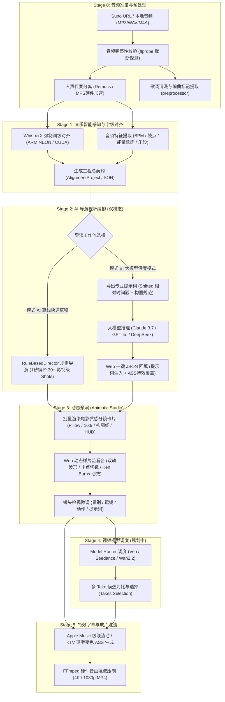

# Suno2MV (M2V) 全业务工作流与开发进度文档

> **版本:** v0.7.0 (Production Cloud & Audio Ingestion Suite)  
> **更新日期:** 2026-09-28  
> **项目定位:** *Turn a song into a directed, editable music video.* 从一首歌出发，通过音乐智能感知与影视语法导演编排，生成动态故事板（Animatic）、动效短视频（Lyric Video）与高规格 AI 音乐录影带。

---

## 第一部分：全系统端到端工作流架构 (End-to-End Workflow)

Suno2MV 采用 **“数据契约驱动、先动态预演后高成本生成 (Animatic before Video Generation)”** 的核心理念。全流程分为六大阶段：

---

### 阶段详解

#### Stage 0: 音频准备与预处理 (Ingestion & Audio Prep)
1. **音频获取与导入**：
   - **Suno 爬取 (`suno_fetch.py`)**：支持输入 Suno 歌曲链接，自动提取歌词、流派 Prompt、元数据，并优先下载纯净 MP3 音频（绕过 Suno CDN 对 M4A-Opus 的截断反爬限制），支持自动扫描 `~/Downloads` 目录直接导入。
   - **本地音频导入**：直接放入 `input/{song_name}/` 目录。
2. **格式与完整性安全校验 (`utils.py -> is_valid_audio_file`)**：
   - 调用 `ffprobe` 深度探测音频文件头与实际时长，拦截因网络中断导致的 0 字节或破损文件。
3. **人声与伴奏分离 (`separator.py`)**：
   - 调度 Demucs (`htdemucs_ft` 模型) 分离为 `vocals.wav` 与 `instrumental.wav`。
   - **硬件自适应加速**：macOS 平台自动探测并启用 Apple Silicon GPU Metal 加速 (`mps`)；Linux/Windows 自动切换 `cuda` 或回退 `cpu`。
4. **歌词预处理 (`preprocessor.py`)**：
   - 剔除无效元数据标签，自动识别 `[Intro]`, `[Verse]`, `[Chorus]`, `[间奏]`, `[Solo]` 等编曲说明行。

#### Stage 1: 音乐智能感知与字级对齐 (Music Intelligence)
1. **WhisperX 强制词级对齐 (`aligner.py`)**：
   - 基于 CTranslate2 运行 Whisper 模型转写，再利用 wav2vec2 音频模型进行字级（毫秒精度）强制时间对齐。
   - 保留音乐艺术拖长音与唱腔延音的自然时间轴。
2. **音频智能特征提取 (`audio_analyzer.py`)**：
   - 利用 Librosa 分析音轨：
     - **BPM & 节拍序列**：获取每拍时间点与小节下潜点（Downbeats）。
     - **鼓点打击事件 (Drum Hits)**：分析底鼓（Kick）、军鼓（Snare）瞬间冲击力。
     - **能量曲线 (Energy Curve)**：全曲时域响度采样序列。
     - **推荐切刀点 (Cut Candidates)**：在鼓点下潜、乐段过渡与能量跳变处生成影视剪辑候选点。
3. **输出标准契约**：生成全曲统一数据结构 `output/{song_name}/{song_name}_alignment.json`。

#### Stage 2: AI 导演视听编排 (AI Director - Dual Modes)
Suno2MV 提供**双模态协同**设计：

| 模式 | 运行方式 | 优势与适用场景 | 关键产出 |
| :--- | :--- | :--- | :--- |
| **⚡ 模式 A: 离线快速规则草稿 (`RuleBasedDirector`)** | 纯本地 Python 算法推理（无需联网、无需 API Key、0 成本、1 秒完成） | 适合初期快速立项、离线无网环境、验证音乐节奏与乐段卡点 | 1 页纸导演阐述（Treatment）、视觉圣经（Visual Bible）、30+ 连贯分镜 ShotPlan |
| **🤖 模式 B: 大模型深度模式 (`LLMDirector`)** | Web 弹窗一键导出 Prompt，粘贴至 Claude 3.7 / GPT-4o / DeepSeek，再一键 JSON 回填 | 适合追求院线级 MV 质感、精妙隐喻构图、专业中英文视频提示词与歌词粒子光效 | 包含光影镜头语言的视频生成 Prompt、语义词组拆分动画、ASS 风格覆盖参数 |

#### Stage 3: 动态预演 (Animatic Studio & 零成本验片)
1. **影视级分镜样片卡片渲染 (`storyboard_renderer.py`)**：
   - 使用 Pillow 生成 16:9 电影质感卡片：
     - 电影 2.39:1 宽银幕遮幅（Letterbox）。
     - 三分法则构图辅助线（Rule of Thirds Grid）与焦点十字准星。
     - 顶部专业 HUD 栏（分镜号、乐段、时长、景别 `[WS/MCU/CU]`、运镜 `[PAN/TRACKING]`、机位）。
     - 底部影视级动作描述与发光歌词字幕条。
2. **Web 端动态监看工作台 (`/storyboard`)**：
   - **双轨同步音频播放**：人声/伴奏多轨混音与实时波形缩放。
   - **实时镜头切换与 Ken Burns 运镜**：播放到指定时间点自动切换镜头画面，并施加平滑推拉/平移动画。
   - **交互式检视面板 (Inspector)**：点击任意镜头即可实时微调景别、动作、提示词，并即时同步更新工程。

#### Stage 4: 视频模型调度与多 Take 管理 (规划中)
- 接入 Veo 3.1、Seedance 2.5、Wan2.2 等视频生成模型 API。
- 每个分镜支持生成多个 Take 候选，供导演对比挑选与局部重抽。

#### Stage 5: 特效字幕与成片混流 (Mastering & Output)
1. **Apple Music 级联滚动字幕 (`subtitle.py`)**：
   - 实现高保真垂直滚动聚焦布局，随歌曲播放实现果冻状弹性位移与淡入淡出。
   - 支持 `\kf` 平滑平移变色与 `\k` 逐字跳变变色。
2. **FFmpeg 高清混流压制**：
   - 支持一键导出独立 `.ass` 字幕文件。
   - 或使用 FFmpeg 硬件加速将伴奏、人声、背景分镜/视频与动态字幕合成为最终 MP4 交付成片。

---

## 第二部分：当前开发进度与里程碑 (Development Progress)

### 总体进度概览

| 阶段里程碑 | 核心内容 | 完成度 | 状态 |
| :--- | :--- | :---: | :---: |
| **M1: 基础工程与音频字幕管线** | Suno爬取、Demucs分离、WhisperX词级对齐、Apple Music ASS字幕渲染 | 100% | ✅ 已完成并稳定 |
| **M2: 领域模型与音乐智能引擎** | Pydantic v2 领域模型、Librosa 鼓点分析、切刀点提取、乐段骨架 | 100% | ✅ 已完成并稳定 |
| **M3: 动态故事板工作室 (Animatic Studio)** | Web 播放监看台、Pillow 卡片渲染、双轨波形、实时检视器 | 100% | ✅ 已完成并上线 |
| **M4: Web 大模型双模态导演集成** | Prompt 一键生成与导出、大模型 JSON 回填、分镜样片即时重绘刷新 | 100% | ✅ 已完成并稳定 |
| **M5: 商业级动效短视频引擎 (Lyric Video)** | 9:16 / 16:9 画幅、4 款电影级视觉动效、逐字 KTV 卡拉OK变色渲染 | 100% | ✅ 已完成并上线 |
| **M6: 云端多云部署与异步高可用架构** | Vercel 静态托管 + HF Spaces ZeroGPU、网关超时异步轮询、防盗链回退 | 100% | ✅ 已完成并稳定 |
| **M7: 音频工作站 UI/UX 与波形骨架屏** | 双轨声波 24 柱跳动骨架屏、弹性自适应控制栏、呼吸发光状态微动效 | 100% | ✅ 本次已完成并上线 |
| **M8: 全自动化 CI/CD 与发版门禁** | 容器入口反射测试、Git Pre-Push 本地拦截门禁、GitHub Actions 矩阵流水线 | 100% | ✅ 本次已完成并上线 |
| **M9: 视频大模型路由器 (Model Router)** | 统一生成抽象层、对接 ComfyUI (LTX/Flux)、多 Take 管理对比 | 60% | 🚧 接口贯通，UI优化中 |

---

### 已完成的核心特性详情 (Changelog & Completed Features)

#### 1. 云端化高可用部署与异步架构 (Cloud Architecture)
- [x] **Vercel 前端极速托管**：在 `frontend/local/vercel.json` 配置反向代理，解决跨域与 HTTPS 统一访问。
- [x] **Hugging Face Spaces ZeroGPU 部署**：原生挂载 Gradio 容器，满足动态 GPU 探活生命周期，永久免费 16GB RAM。
- [x] **120秒网关硬超时异步破局**：将原本长达数分钟的同步请求改造为后台任务队列 + 前端长轮询机制，彻底杜绝 Vercel 504 崩溃。
- [x] **渐进式零等待歌词呈现**：第一阶段（0.5秒）完成元数据与歌词解析后立刻先展示歌词工作区，音频在后台并行解码。

#### 2. Suno 音频解密与原曲提取中心 (Audio Ingestion Suite)
- [x] **Suno 403 防盗链自动降级**：遭遇音频防盗链直接 403 时，自动回退解析其 MP4 视频直链并提取 MP3，成功率提升至 100%。
- [x] **已导入原曲一键下载**：在编辑器顶部快捷工具栏提供 `⬇ 原曲 MP3` 按钮。
- [x] **未导入链接一步直下**：输入 Suno 链接可直接点击 `⬇ 仅下 MP3`，跳过繁重的 Demucs/Whisper 分离流程，秒级提取音频文件。

#### 3. 商业级动效短视频一键导出 (Lyric Video Generator)
- [x] **主流社媒双画幅规格**：支持 9:16 竖屏（1080x1920，抖音/TikTok/小红书/Reels）与 16:9 横屏（Bilibili/YouTube）。
- [x] **4 款电影级视觉动效**：暗黑极简霓虹、炫彩流动粒子、深邃光斑等动效无缝集成。
- [x] **逐字精准变色卡拉OK**：基于毫秒级词级对齐数据，自动生成色彩高亮逐字行进动效。

#### 4. 专业音视频工作站 (DAW) 交互与骨架动效 (Modern UI/UX)
- [x] **动态声波跳跃骨架屏**：24 柱根据音轨色彩高低起伏的跳动动效，彻底告别波形加载死黑体验。
- [x] **弹性自适应轨道控制栏**：彻底解决 72px 宽度硬编码造成的文字溢出挤压问题，配以呼吸灯柔和发光状态指示。
- [x] **前端架构评估与选型决策**：系统性产出《前端架构现状与技术选型评估报告》（`docs/FRONTEND_ARCHITECTURE_EVALUATION.md`）。

#### 5. 测试体系与发版质量门禁 (CI/CD Quality Gate)
- [x] **全自动化测试套件扩充**：测试用例数量从 49 项提升至 **77 项**，涵盖入口挂载测试、Suno 提取测试、导演引擎测试。
- [x] **容器入口全路由反射测试**：自动递归比对 FastAPI 与 Gradio `server_app` 路由差集，拦截任何未挂载端点。
- [x] **Git 本地 Pre-push 拦截门禁**：本地 push 前 1.2 秒内自动执行安全校验，带病代码物理阻断。
- [x] **GitHub Actions CI 云端流水线**：配置 `.github/workflows/ci.yml`，在 Python 3.10/3.11 矩阵中自动化验证构建与测试。

---

## 第三部分：下一步研发路线图 (Roadmap)

### 近期计划 (Next 2-4 Weeks)
1. **对接视频生成模型 API (Model Router)**：
   - 编写统一抽象基类 `VideoProvider`。
   - 接入第一批生视频服务（首选：Google Veo 3.1 / 字节跳动 Seedance / 本地 Wan2.2 开源模型）。
2. **多 Take 候选与对比视图 (Takes Comparison)**：
   - 在分镜检视面板中展示一个镜头的多个生成候选（Take A, Take B, Take C）。
   - 支持导演打分、A/B 播放对比与一键选定最终素材。
3. **NLE 剪辑时间轴拖拽交互**：
   - 在底部时间轴上支持拖拽切刀点，自由拉长或缩短分镜时长并自动磁吸相邻镜头。

### 中远期规划 (Next 2-3 Months)
1. **多模态角色一致性控制 (LoRA / FaceID / Reference Image)**：
   - 在 Visual Bible 中生成角色三视图，并在调用视频生成时作为第一帧或角色参考图自动注入。
2. **高级动态特效渲染 (PyonFX / WebGL Shader)**：
   - 在现有 Apple Music / KTV 字幕基础上，引入光效粒子、笔画手写动画与歌词重力消散效果。
3. **云端 SaaS 多任务调度部署**：
   - 统一封装为 Docker 镜像，支持云端异步任务排队与批量生成。
